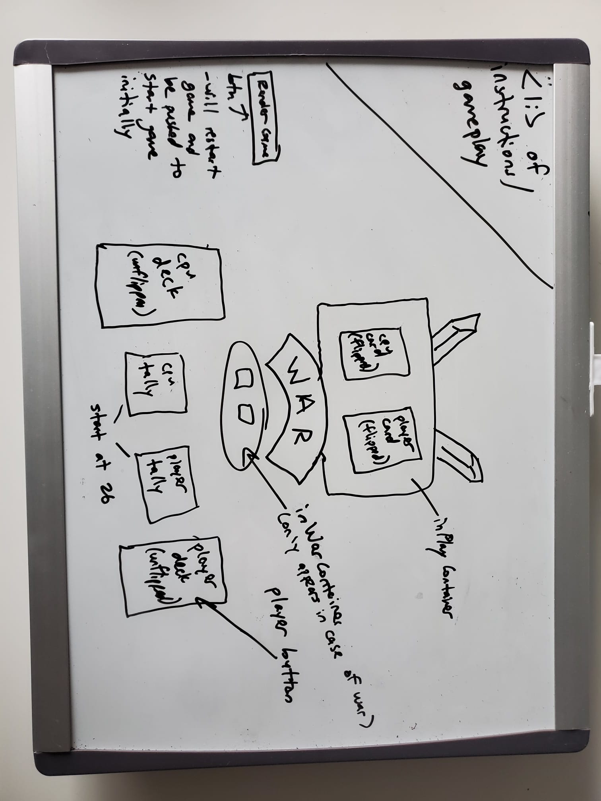
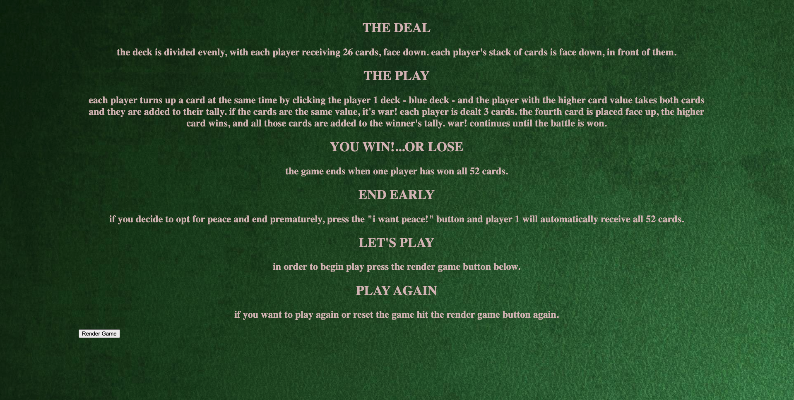
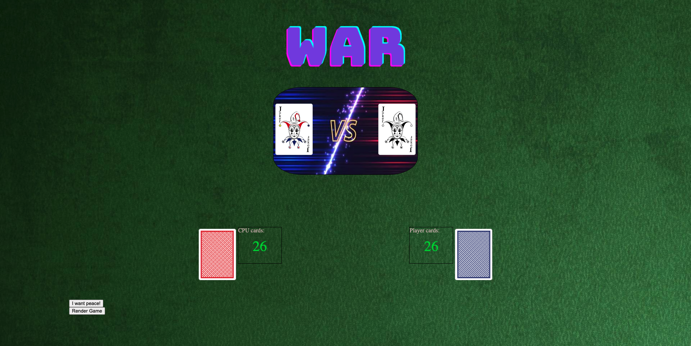
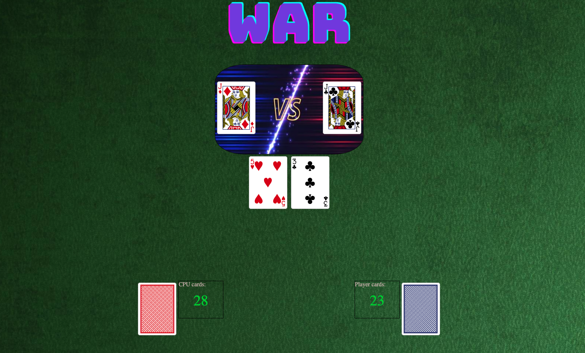
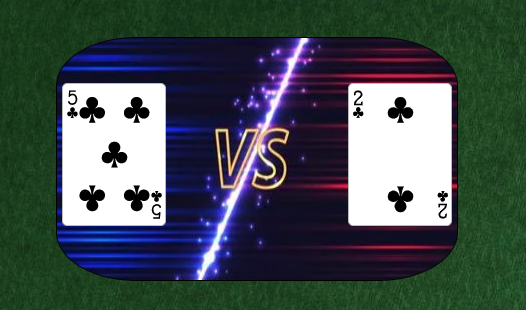

# **WAR** A Battle of Cards
## Rules and General Overview
War is a 2 person card game. The deck is shuffled and split evenly between the two players - CPU and Player 1. Then each player flips a card by clicking the player's deck (blue side) and the highest value - regardless of suit - wins the cards in play. First player to collect all 52 cards wins the game. If both cards match then it's war! Each player automatically adds 3 cards to the in play container and the 4th card is flipped, highest card wins the total amount of cards in play - 8. 

## Screenshots 

**This was the starting point for the game. From a simple wire frame came what could be considered the best WAR game on the net**
  

   
**The initial page is where the rules are shown**
  

   
**The game board where War is waged**
  

   
**During WAR the container below the cards In Play show the 4th card that was flipped**
  

   
**This is the In Play container where the current cards in play will sit.**
  

   

## Technologies Used

-  HTML

-  CSS

-  Javascript
  

## About the Creator 
- This is the first project written from the ground up by Dylan Burston.. stay tuned for the next one!

