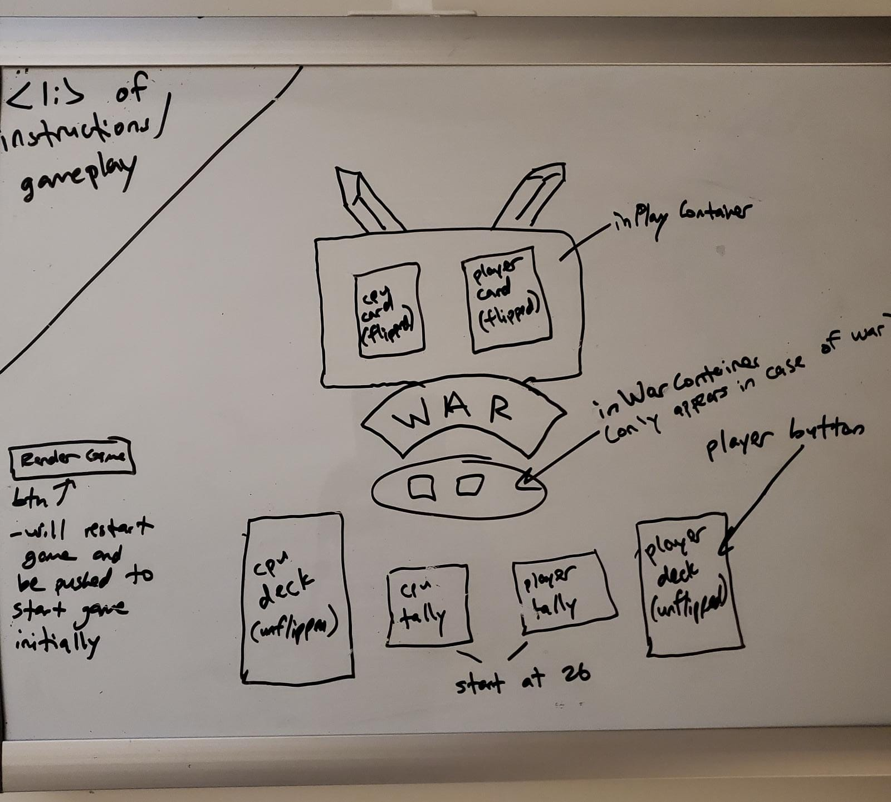

# **WAR** A Battle of Cards
## Rules and General Overview
War is a 2 person card game. The deck is shuffled and split evenly between the two players - CPU and Player 1. Each player then flips a card automatically by clicking the player's deck (blue deck) and the highest value - regardless of suit - wins the cards in play. First player to collect all 52 cards wins the game. If both cards match then it's war! Each player automatically adds 3 cards to the In Play container and the 4th card is flipped, highest card wins the total amount of cards in play - 8. 

**Note**
-- the cards shown in the In Play container immediately after the click have **already** been added/ subtracted from the appropriate deck. As you can see the displayed cards are 10 and 6, the computer of course won. That means that prior to the click the tally was CPU - 22 vs. Player - 28.

  

## Screenshots 
- This was the starting point for the game. From a simple wire frame came what could be considered the best WAR game on the net

   
- The initial page is where the rules are shown
  

   
- The game board where War is waged 
  

   
- During WAR the container below the cards In Play show the 4th card that was flipped
  

   
- This is the In Play container where the current cards in play will sit.
  

   

## Technologies Used
 

   
  HTML

 

  
  CSS

 

   
  JAVASCRIPT

## Game Play
Click [here](https://pages.git.generalassemb.ly/dburston/War-Card-Game/) in order to play the game. 
## About the Creator 
**This is the first project written from the ground up by Dylan Burston.**
- **[Linkedin](https://www.linkedin.com/in/dylan-burston-09727265/)**

  

